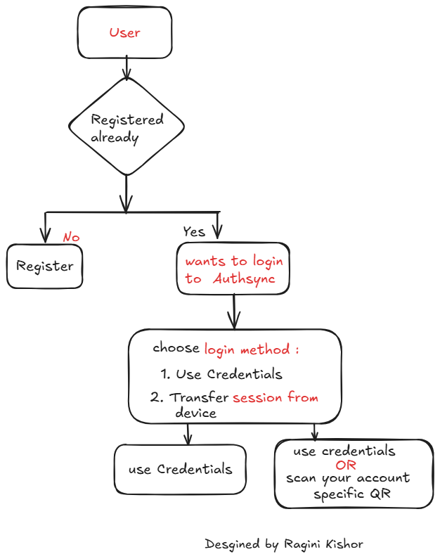
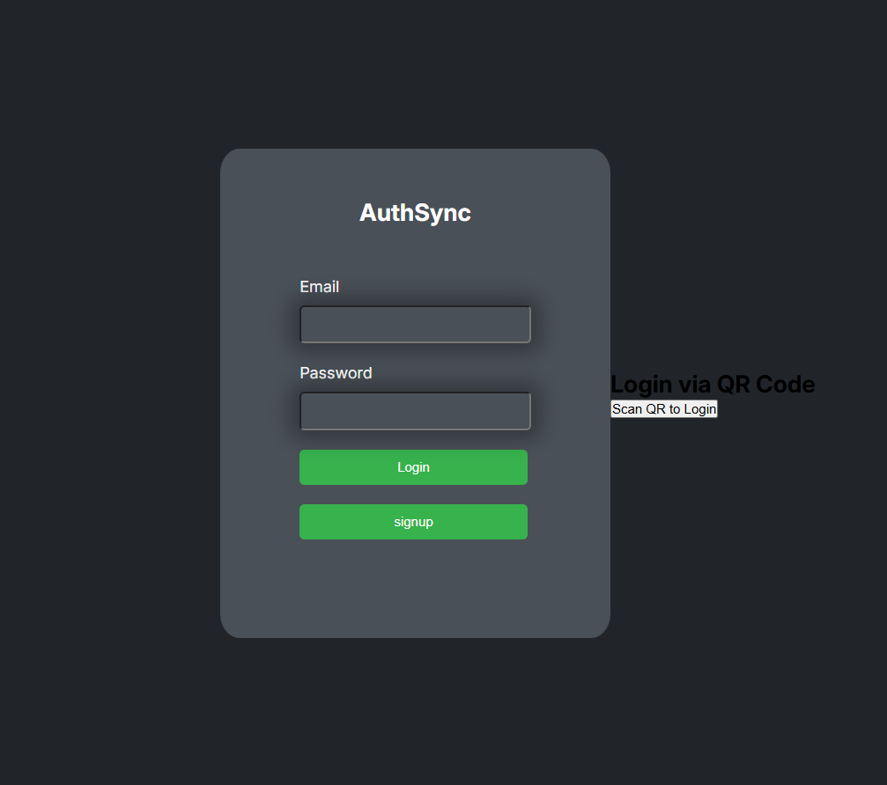
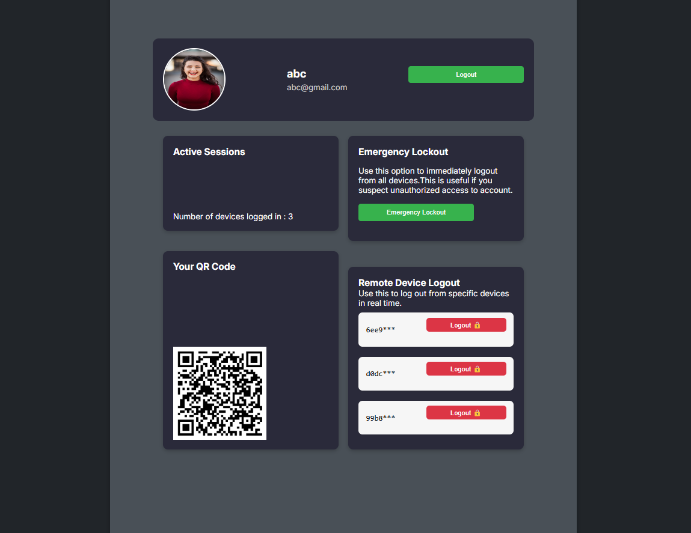
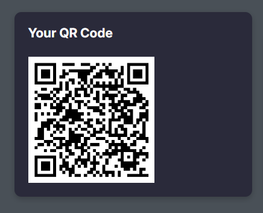
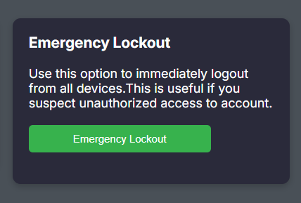

## 📌 Overview

**AuthSync** is a backend-focused authentication system that supports **secure session transfer between devices**, built with the idea of enhancing user experience across platforms — inspired by passwordless concepts like **FIDO2**.

This project goes beyond traditional JWT-based login flows by enabling:
- 🔁 **Multi-device session continuity** — scan a QR from one device to access the same session on another
- 📱 **Device-level session management** — see all devices currently logged in
- 🚨 **Emergency lockout** — force logout from all devices in case of suspicious activity

---

### 🔐 Core Highlights

- **Session Transfer via QR**  
  Enables users to scan a QR code from a second device and instantly resume the session without re-entering credentials.

- **Device Tracking**  
  Tracks all devices logged in per user, showing unique **device IDs**, timestamps, and active status.

- **Emergency Lockout**  
  Allows the user to immediately log out from all devices remotely, acting as a safety mechanism during unauthorized access.

- **Secure Token Lifecycle**  
  Uses JWT and session strategies to manage login, logout, refresh, and expiration securely across devices.

---

This system simulates a modern multi-device authentication experience, making it an ideal backend concept project for demonstrating real-world, security-first thinking.

## 🔐 Session Flow: Multi-Device Login

The diagram below explains how session transfer and login flow work across multiple devices in a simplified way.

## 📸 UI Screenshots

<h3>🔐 Login UI</h3>

<h3>🔐 AuthSync Dashboard</h3>

<h3>🔐 User account specifc QR for session Transfer across devices</h3>

<h3>🛑 Emergency Lockout Interface</h3>

## Feedback and Suggestions
This project is a part of my learning journey, and I aim to implement real-world solutions for secure session management. If you have any suggestions, feedback, or ideas for improvement, I would greatly appreciate hearing them. Constructive criticism is always welcome and will help me refine and enhance the project further

